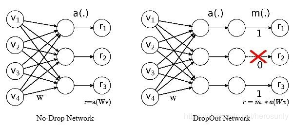

# 了解知道Dropout原理
   想要提高神经网络的表达或分类能力，最直接的方法就是采用更深的网络和更多的神经元，即deeper and wider。但是，复杂的网络也意味着更加容易过拟合。于是就有了Dropout，大部分实验表明其具有一定的防止过拟合的能力。最早的Dropout可以看Hinton的这篇文章 《Improving neural networks by preventing co-adaptation of feature Detectors》。

(1) 由于随机的让一些节点不工作了，因此可以避免某些特征只在固定组合下才生效，有意识地让网络去学习一些普遍的共性（而不是某些训练样本的一些特性）

  (2) Bagging方法通过对训练数据有放回的采样来训练多个模型。而Dropout的随机意味着每次训练时只训练了一部分，而且其中大部分参数还是共享的，因此和Bagging有点相似。因此，Dropout可以看做训练了多个模型，实际使用时采用了模型平均作为输出
（具体可以看一下论文，论文讲的不是很明了，我理解的也够呛）

  训练的时候，我们通常设定一个dropout ratio = p,即每一个输出节点以概率 p 置0(不工作)。假设每一个输出都是相互独立的，每个输出都服从二项伯努利分布B(1-p)，则大约认为训练时 只使用了 (1-p)比例的输出。

  测试的时候，最直接的方法就是保留Dropout层的同时，将一张图片重复测试M次，取M次结果的平均作为最终结果。假如有N个节点，则可能的情况为R=2^N,如果M远小于R，则显然平均效果不好；如果M≈N，那么计算量就太大了。因此作者做了一个近似：可以直接去掉Dropout层，将所有输出 都使用 起来，为此需要将尺度对齐，即比例缩小输出 r=r*(1-p)。

# 用代码实现正则化(L1、L2、Dropout）
```import torch
from torch.autograd import Variable
from torch.nn import functional as F


class MLP(torch.nn.Module):
    def __init__(self):
        super(MLP, self).__init__()
        self.linear1 = torch.nn.Linear(128, 32)
        self.linear2 = torch.nn.Linear(32, 16)
        self.linear3 = torch.nn.Linear(16, 2)

    def forward(self, x):
        layer1_out = F.relu(self.linear1(x))
        layer2_out = F.relu(self.linear2(layer1_out))
        out = self.linear3(layer2_out)
        return out, layer1_out, layer2_out


def l1_penalty(var):
    return torch.abs(var).sum()


def l2_penalty(var):
    return torch.sqrt(torch.pow(var, 2).sum())


batchsize = 4
lambda1, lambda2 = 0.5, 0.01
for i in range(1000):
  model = MLP()
  optimizer = torch.optim.SGD(model.parameters(), lr=1e-4)

  # usually following code is looped over all batches 
  # but let's just do a dummy batch for brevity

  inputs = Variable(torch.rand(batchsize, 128))
  targets = Variable(torch.ones(batchsize).long())

  optimizer.zero_grad()
  outputs, layer1_out, layer2_out = model(inputs)
  cross_entropy_loss = F.cross_entropy(outputs, targets)
  l1_regularization = lambda1 * l1_penalty(layer1_out)
  l2_regularization = lambda2 * l2_penalty(layer2_out)

  loss = cross_entropy_loss + l1_regularization + l2_regularization
  print(i, loss.item())
  loss.backward()
  optimizer.step()
```
# Dropout的numpy实现

# PyTorch中实现dropout
```dim_in = 28 * 28
dim_hid = 128
dim_out = 10

class TwoLayerNet(torch.nn.Module):
    def __init__(self, dim_in, dim_hid, dim_out):
        super(TwoLayerNet, self).__init__()
        # define the model architecture
        self.fc1 = torch.nn.Linear(dim_in, dim_hid, bias=True)
        self.fc2 = torch.nn.Linear(dim_hid, dim_out, bias=True)
    
    def forward(self, x):
        x = x.view(x.size(0), -1)
        x = self.fc1(x)
        x = F.relu(x)
        x = F.dropout(x,p=0.5)             #dropout
        x = self.fc2(x)
        return F.log_softmax(x, dim=1)

# 提前定义模型
model = TwoLayerNet(dim_in, dim_hid, dim_out)
if USE_CUDA:
    model = model.cuda()
```